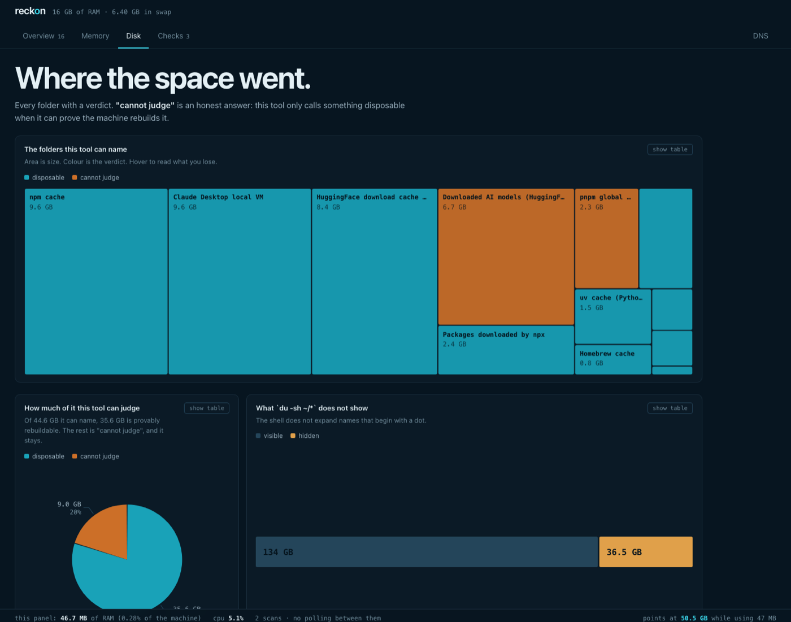

# reckon

**A local dashboard that tells you what to do about your Mac — and never deletes anything itself.**

`docker system df` told me a container was using **164.9 kB**. Its log file was **10 GB**.

That is not a bug in Docker. The command measures a container's *writable layer* and never
its `-json.log`, so a container stuck in a restart loop can write gigabytes that no Docker
command will ever show you. I only found it because I went looking inside the VM. This tool
is what came out of that.



*The Disk tab. Area is size, colour is the verdict, and "cannot judge" is a real answer.*

---

## What it is

Most disk tools show you a treemap and leave the thinking to you. This one opens with a
decision:

> **You can free 50.5 GB.** 9.95 GB in the log of a container stuck restarting · 9.60 GB in
> the npm cache · 9.57 GB in a local VM you have not used since May · and 13 smaller items.
> **Staying put:** 6.7 GB of downloaded AI models and a worktree holding unmerged commits,
> because neither can be proven rebuildable.

Every item carries three things, always: **how much it frees**, **the proof of that number**,
and **what you lose if the verdict is wrong**. Without all three it does not become a row.

### It never deletes anything

Not a safety toggle — a design constraint. `reckon` writes only inside `~/.cache/reckon/`. It
reads your machine, works out what it thinks, hands you the command, and stops. You run it.

That rule is why the interesting work is in the *judgement*, not in the deleting. A tool that
deletes has to be conservative to be safe. A tool that only recommends can afford to say
exactly what it found and exactly how sure it is.

### It measures itself

A panel that runs all the time spends the memory it is measuring. So the footer shows, always,
how much RAM and CPU `reckon` itself is using and how that compares to what it found. On the
machine it was built for: **46 MB, 0.28% of RAM**, against 50.5 GB pointed at. If that ever
inverts, the footer says so instead of hiding it.

The architecture follows from that. No framework, no bundler, **no dependencies at all**.
Collection happens on demand — between your clicks the process sits at 0% CPU. There is no
background daemon and no telemetry; nothing leaves the machine.

---

## Install

```bash
git clone https://github.com/Arthuro0103/reckon.git
cd reckon
node server.js          # http://127.0.0.1:4127
```

Node 18+. There is no `npm install` — the project has no dependencies.

```bash
node bin/scan.js        # deep scan from the terminal (~2 min)
node bin/check.js       # the test suite
```

The first visit asks for a scan. It reads the disk folder by folder, enters the Docker VM, and
runs `git` in every repository — about two minutes, cached afterwards in `~/.cache/reckon/`.
Nothing is measured again until you ask.

**Configuration is optional.** `reckon` looks for your code in the usual places (`~/code`,
`~/dev`, `~/src`, `~/Projects`, `~/repos`, `~/git`, `~/work`, `~/www`, `~/Developer`) and finds
Obsidian vaults by their marker directory. To override any of it, copy
`reckon.config.example.json` to `reckon.config.json` — that name is gitignored, so your paths
never end up in a commit.

---

## The tabs

| tab | what it does |
|---|---|
| **Overview** | the decisions, ordered by how much they free. The screen that opens |
| **Memory** | what is using RAM now, grouped by app, and how much each changed since you opened |
| **Disk** | where the space went, folder by folder, with a verdict: `disposable` · `yours` · `cannot judge` |
| **Checks** | what is broken and has a fix |
| **DNS** | two halves: a blocklist you build, and the resolver your machine asks |

DNS is a **separate tab on purpose**. A bug in the monitor shows a wrong number; a bug in DNS
leaves you without internet, and you will not connect the two. Neither can take the other down,
and neither imports the other's code.

---

## The guards, and what each one cost somebody

**Symlinks.** Before suggesting you delete a directory, `reckon` looks for a symlink pointing at
it. `ls` and `du` follow symlinks, which makes the target and the link look like two independent
things.

**Hard links and APFS clones.** `du` counts the same block twice when pnpm or APFS share files,
so deleting one copy can free nothing. On any target above 1 GB, `reckon` counts files with
`nlink > 1` and warns when the number may be inflated.

**Sparse files.** `Docker.raw` reports 1 TB and occupies 20 GB. `reckon` measures allocated
blocks (`stat -f %b`), not apparent size. For a directory it sums the blocks of every file:
reading the folder's own inode is how a 9.57 GB bundle once measured as zero.

**Docker volumes.** `docker volume prune` does not touch **named** volumes, and
`prune --volumes` while a container is stopped deletes that container's volume with it. `reckon`
separates the three cases — genuinely orphaned, attached to a stopped container, in use by a
running one — and only ever recommends removing the first group, one at a time, by name.

**Commits off the main branch.** Before calling any folder garbage, `reckon` runs
`git rev-list --count main..HEAD`. Then it goes further and checks whether those commits exist
on any remote. 175 commits off your local `main` but pushed to `origin` is one kind of risk;
175 that exist only on this disk is another. The screen keeps them apart.

**Obsidian vaults are minefields.** Inside an iCloud-backed vault `ls` lies: iCloud evicts file
contents and leaves placeholders, so a directory listing can report fewer files than the vault
holds. The count you can trust is `git ls-files`. And `.git` is never garbage — it is the only
copy of everything you have written **and deleted**.

**DNS.** Every change ships with the undo built from what is configured right now, and the undo
appears **before** the apply, numbered as step 1. If DNS breaks, you cannot search for how to
fix it. No silent `sudo`: the panel writes the text, you read it and type it.

**The blocklist.** You build the list on screen — ready-made sets, or one domain at a time.
`reckon` keeps it in a file of its own, generates the snippet at
`~/.cache/reckon/hosts-block.txt`, and shows the command. It never writes a line to
`/etc/hosts`. The snippet is delimited by markers, so the undo removes exactly that and leaves
the rest of the file intact, and the first apply saves a copy to `/etc/hosts.before-reckon`.

The limit sits on screen above the buttons: **`/etc/hosts` matches exact names.** Blocking
`doubleclick.net` does not block `ad.doubleclick.net`, and there are no wildcards. To catch a
domain and everything under it you need a filtering resolver — the other half of the tab.
Without that warning somebody builds the list, applies it, still sees an ad, and concludes the
tool is broken.

---

## The charts

All hand-drawn in SVG. A panel that measures RAM should not load 300 kB of library to draw a bar.

| shape | answers |
|---|---|
| cumulative steps | do these in order — where does free space land? |
| pie | what *kind* the leftovers are — half of it is package cache, which comes back on its own |
| columns | the biggest ones side by side, judged by height |
| donut with emphasis | how the whole splits, and which slice needs a decision |
| horizontal bars | who is biggest, when names are too long to sit under a column |
| grouped bars | what Docker *counts* against what it *occupies* — the blind spot, measured |
| treemap | area is size, colour is verdict, the whole disk on one screen |
| scatter | age against weight per project, ringed where commits sit off `main` |
| indexed line | swap and compression on one plot, both rebased to 100 |
| area with crosshair | swap and compression over the session |
| gauge | how much disk, swap and RAM is spoken for |

Rules that hold in every one of them:

- **One axis. Never two.** Swap (MB) and compressed memory (GB) appear either as two small
  charts or as one chart with both rebased to **index 100**. What does not happen is dividing one
  measure by 100 so it "fits" the other — that is a dual axis in disguise, and the alignment
  would be mine rather than the data's.
- **Every shape has a table twin**, behind a `show table` button. A tooltip improves reading; it
  is never the only way to read a value.
- **Direct labels are selective.** The two or three largest, or the extreme. A number on every
  point is chaos and goes unread.
- **A nominal category gets one colour.** Shading each bar by its size spends the identity
  channel repeating what length already says.
- **Thin marks, 1px solid gridlines** (never dashed), a 2px gap in the surface colour between
  touching marks — separation by gap, not by a border drawn around things.

### Colour

Cyan `#19a2b8` on deep ocean blue `#0b1a26`. The eight series colours were not picked by eye —
they pass all six checks of a categorical-palette validator against the real surface:

```
lightness band        PASS   all 8 inside OKLCH L 0.48–0.67
chroma floor          PASS   all 8 at C >= 0.10
CVD separation        PASS   worst adjacent pair dE 10.3 (protanopia)
normal-vision floor   PASS   worst adjacent pair dE 20.0
contrast vs surface   PASS   all 8 above 3:1
```

Shapes where any mark can touch any other — scatter, treemap — use at most three of them,
because the all-pairs check is stricter. The slot order is the colour-vision safety mechanism:
it does not change, and a ninth series does not exist.

**Status never becomes a colour.** There is no green or red anywhere in this project.
`disposable` and `stays` are told apart by position and label; urgency in Checks is the word
"now" or "later". Colour from outside the palette appears in exactly two places, and always
because it **links** a number to its proof or marks the **boundary** between what goes and what
stays.

To rebrand: replace the values in `web/tokens.css` and re-run a palette validator against your
surface. Nothing else needs to change.

---

## What it does not do yet

- **It deletes nothing, and that is permanent.** There is no execute button and there will not
  be one.
- **It does not follow up.** After you run a command it has no idea you ran it. Ask for a new
  scan to see the number move.
- **It only knows the folders somebody taught it.** The Disk tab has a fixed list of known
  targets (npm, pip, uv, Homebrew, HuggingFace, Playwright, Xcode, Gradle, Cargo, Go…). A 30 GB
  folder outside that list shows up in the "top of your home folder" table with no verdict, and
  the tool says **"cannot judge"** rather than guessing.
- **It judges a project only by commit date.** Sixty days quiet marks its `node_modules`
  disposable. An active project that simply receives no commits is not told apart from an
  abandoned one.
- **No external disks or other volumes.** Only this machine's data volume.
- **The DNS tab applies nothing and verifies nothing afterwards.** It writes the three commands
  — undo, apply, check — and stops.
- **The blocklist cannot tell whether you applied it.** It counts what is live inside its own
  markers in `/etc/hosts`; edit the file by hand outside them and it will not see it.
- **The ready-made sets are small and hand-written.** Dozens of domains, not the hundreds of
  thousands in a community-maintained list. For real coverage the answer is a filtering
  resolver, not `/etc/hosts`.
- **Memory history dies with the process.** It lives in server memory, capped at 120 points.
- **No authentication** — and none is needed: the server refuses any connection that is not
  loopback, and listens on `127.0.0.1` only. Do not expose it. This panel can see the whole
  machine, and that is a map of it.
- **macOS only.** It leans on `vm_stat`, `tmutil`, `networksetup`, `scutil` and Docker
  Desktop's VM layout. Tested on Apple Silicon running macOS 26; Intel should work and has not
  been verified.

## Contributing

The one rule: **nothing in this repository may delete, move or overwrite anything outside
`~/.cache/reckon/`.** A pull request that adds an execute button will be declined, however
convenient it looks.

`node bin/check.js` has to pass. It exists because adding accents to this project's copy once
silently corrupted six names that are contracts — a require path, a tab id, an API key, a query
parameter — and `node --check` passed on every one of them. The worst produced
`networksetup -setdnsservers null`, which does not show a wrong number: it takes the internet
down.

## License

MIT.
