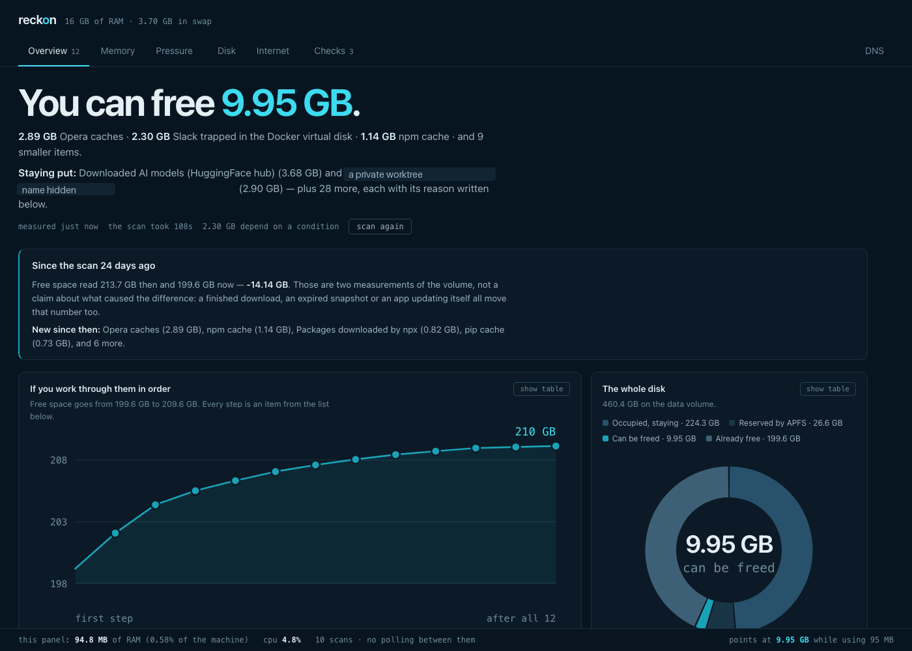
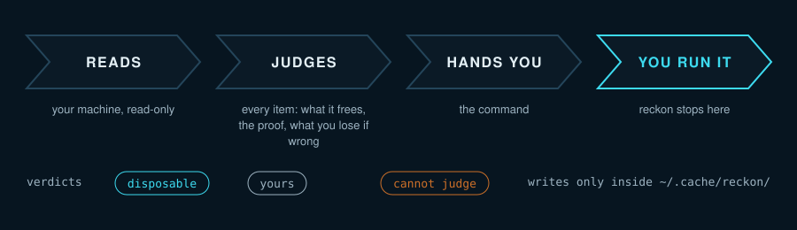
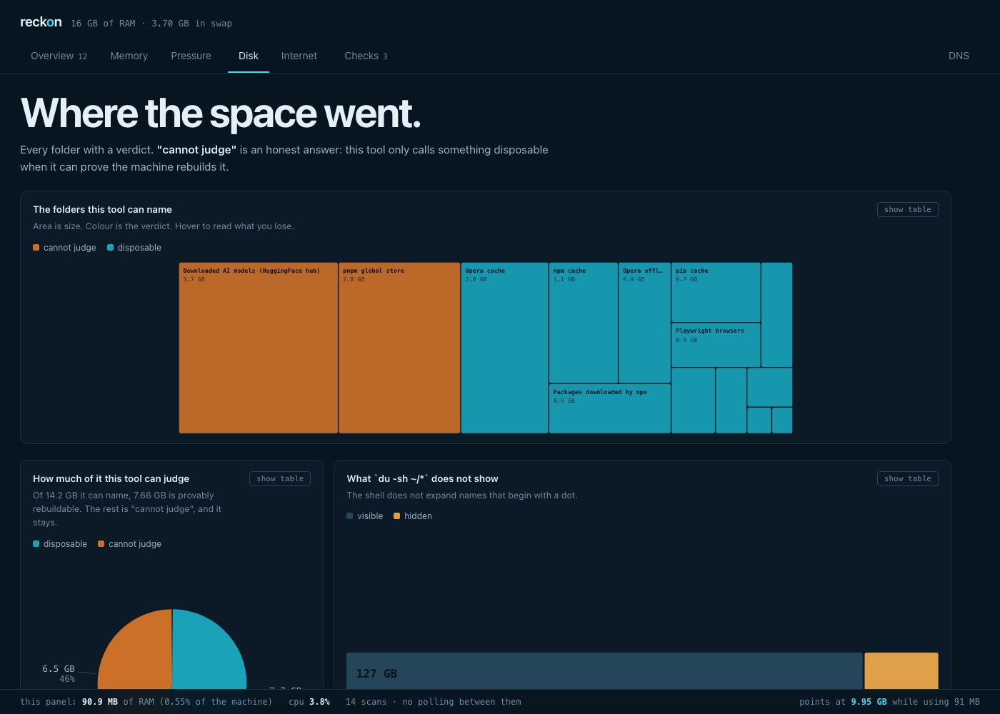
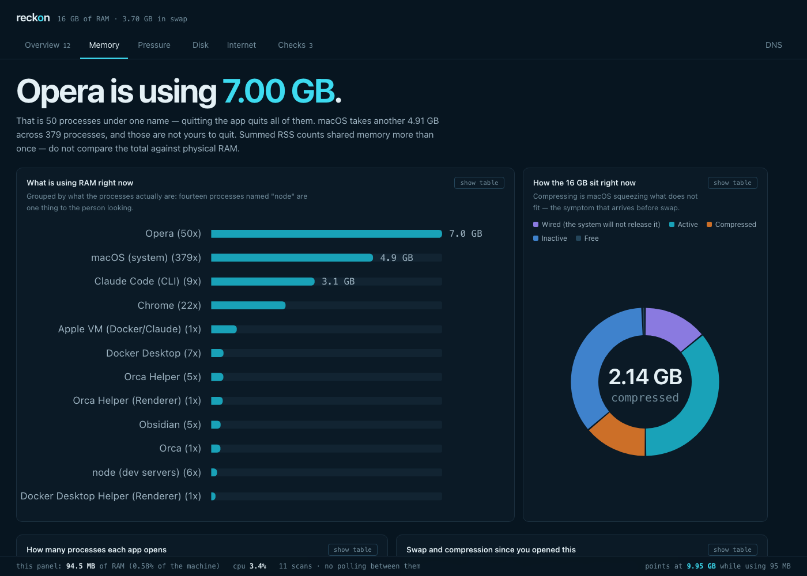
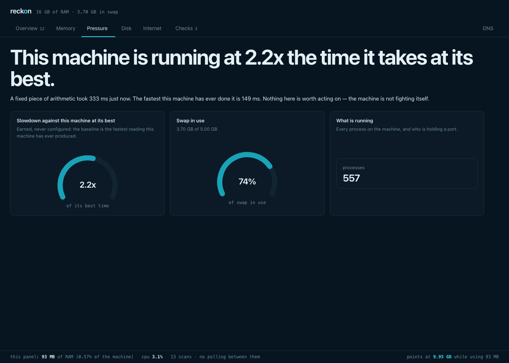

<p align="center">
  
</p>

**reckon tells you what to do about a full or struggling computer, and never deletes anything you did not click.** It runs on your machine, on macOS and Windows, with no dependencies and no telemetry.

## Why it exists

It started because my computer felt painfully slow. An AI assistant went through it and found about 50 GB I could free. I built reckon to go deeper than that, and to work for any machine instead of only mine. On the same computer it found roughly another 100 GB, almost all of it Docker data sitting in caches nobody knew about.

That is one machine and one author, so read it as the story of why the tool exists, not as a benchmark. Three decisions came out of it:

1. **A decision, not a treemap.** Most disk tools draw the folders and leave the thinking to you. reckon opens with what you can free, and why each item is safe.
2. **It never deletes anything on its own.** It reads your machine, works out what it thinks, hands you the command, and stops. You run it, or you click **Do** on a row from its closed table of actions, read the preview and confirm (below).
3. **"Cannot judge" is an answer.** It only calls something disposable when it can prove the machine rebuilds it. Everything else it names and leaves alone.



*The Overview, captured 2026-10-06 on the author's machine. One private project name is covered.*

## What it is

Every item carries three things, always: **how much it frees**, **the proof of that number**, and **what you lose if the verdict is wrong**. Without all three it does not become a row.



### It deletes only with one click

Not a safety toggle, a design constraint. reckon's own files go only inside `~/.cache/reckon/`. It reads your machine, works out what it thinks, and shows you the proof. Anything that changes your machine (sudo, DNS and `/etc/hosts` among it) is handed to you as a command to run yourself.

The one way reckon acts, decided on 2026-10-07: **reckon never does anything you did not click, and never anything outside its table of actions.** On the Memory and Pressure tabs a row it is sure enough about (`high` or `medium`) gets a **Do** button that can quit an app gracefully (it asks to save first), stop orphaned processes, shut iOS simulators down, quit a Docker VM with no container running, end an idle AI session, stop orphaned MCP or tool servers, or unload a model Ollama keeps in memory (table below). The page sends only the row's id; the server measures the target again, shows a preview with the proof and what you lose, waits for your Confirm and five seconds you can cancel, runs the fixed command with no shell and no sudo, and shows memory before and after. Each one is logged in `~/.cache/reckon/actions.log`.

For people who work with AI tools all day, three of those memory rows, each judged again at the click with the same rules it was offered on:

| Do | Offered only when | What runs |
|---|---|---|
| End an idle AI session (`claude`; `codex`, `aider`, `opencode`, `grok` stay copy-only) | older than 6 h, no live child process, its terminal device neither read nor written for 2 h, and the newest transcript for its folder under `~/.claude/projects/` not modified for 2 h (its modification time only: the file is never opened). Never reckon itself, anything reckon runs inside (its terminal, its shell, the agent that started it), a session on reckon's terminal, or a CLI whose parent is an app. If idleness cannot be measured, there is no button | `kill -TERM <pid>`, nothing else. The conversation stays on disk; the row shows `cd <folder> && claude --resume` |
| Stop orphaned MCP / tool servers (MCP servers, `npx`, `uvx`, language servers) | the root's parent is gone (ppid 1, not launchd, not in an app), older than 1 h, nothing else on its terminal, nothing in its tree listening on a port. Grouped by tool, with the total RSS | `kill -TERM` of the group |
| Unload an Ollama model | Ollama's own `GET http://127.0.0.1:11434/api/ps` (fixed loopback address, 2 s, no redirect) lists the model at the click, its name passes a strict pattern, and `ollama` is on PATH (otherwise the row says so and has no button). LM Studio and llama.cpp are detected and stay copy-only | `ollama stop <model>`, the name as one argument. Reversible: the model reloads on its next use |

The same engine acts on disk, from the last deep scan, decided by the owner the same day. What is **yours** goes to the Trash, where you can put it back; a **regenerable** cache is removed for good, and the button says which before you click. Every disk target is measured again at the click, and refused if it changed since the scan.

| Do | What runs | Removal |
|---|---|---|
| Clear a cache the table names (npm, Homebrew, Go, pip, uv, Quick Look thumbnails) | the tool's own cleaner: `npm cache clean --force`, `brew cleanup --prune=all`, `go clean -cache`, `pip cache purge`, `uv cache clean`, `qlmanage -r cache` | regenerable, for good |
| Clear any other cache the table names (browser caches, npx, Playwright, Xcode DerivedData, Gradle, Cargo…) | reckon's own `safeRemove()`: inside your home, on the table, no link along the path, never `~`, `~/Library`, `~/Documents`, `~/Desktop`, `~/Downloads` or a dotfile at the top of home | regenerable, for good |
| `node_modules` of a parked repository | `safeRemove()` of `<repo>/node_modules` only, after checking there is no commit and no changed file since the scan | regenerable, for good |
| A worktree already merged | `git worktree remove` without `--force`; if git refuses, its error is shown and nothing is forced | git |
| iPhone and iPad backups, Mail attachment copies | `/usr/bin/trash`, or Finder when it is missing | to the Trash |
| Unused Docker volumes, old build cache, stopped containers | `docker volume rm <names>` (re-checked unattached), `docker builder prune --filter until=48h`, `docker system prune` with no `-a` and no `--volumes` | Docker, for good |
| Simulators whose iOS runtime is gone | `xcrun simctl delete unavailable` | for good |
| Empty the Trash | Finder's Empty Trash, after **two** confirmations | for good |

Rows can be ticked into a queue: one preview with the summed total, one confirmation, then one by one, each logged, stopping at the first one that is refused. After a run the screen shows free space before and after, read with a light `df`, not a new scan.

**"I need X GB" (Memory tab).** Pick 2, 4 or 8 GB, or type your own, and reckon builds a plan from the rows that already have a button: it never invents an action, and only `high` and `medium` rows are in it. What comes back without a loss goes first (an Ollama model, orphaned tool servers, an idle AI session that has a resume command, simulators, a Docker VM with no container), then the stops that cannot be undone, and the apps whose quit asks to save go last, flagged "asks to save first". Each line says "up to N MB", which is what that row held when it was measured and never more, with a running total, and the list stops as soon as it reaches the gap between what you asked for and what is available now (`lib/headroom.js`). When the whole list cannot get there it says so: "these free up to X GB; you asked for Y GB; nothing else here is safe to stop". The plan itself runs nothing (`POST /api/act/plan`). **Review and do** hands it to the queue above: one summed preview, one Confirm, five seconds with Cancel, one by one with each target measured again at the click, stopping at the first refusal. The available memory is read after every step and the remaining steps are skipped, and said to be skipped, the moment it is enough. The result shows the real available memory before and after.

Helpers are shown under their parent app as one row ("Orca: 7 processes, 410 MB"), expandable, and only the app row has the quit button. No helper has an action of its own.

**Docker advice (Memory tab).** While Docker Desktop's VM is running, a text-only card shows the memory limit set for it (read from Docker Desktop's own settings file, read-only; see `docs/PRIVACY.md`), that limit as a share of this machine's RAM, how many containers are running (not asked while Docker is asleep, because asking would wake it), and where to change it: Docker Desktop > Settings > Resources. It has no button.

That rule is why the interesting work is in the *judgement*, not in the deleting. A tool that deletes has to be conservative to be safe. A tool that only recommends can afford to say exactly what it found and exactly how sure it is.

### It measures itself

A panel that runs all the time spends the memory it is measuring. So the footer shows, always, how much RAM and CPU `reckon` itself is using and how that compares to what it found. In the Overview above: 94.8 MB of RAM (0.58% of the machine) and 4.8% CPU, pointing at 9.95 GB. If that ever inverts, the footer says so instead of hiding it.

The architecture follows from that. No framework, no bundler, **no dependencies at all**. Collection happens on demand: between your clicks the process sits at 0% CPU. There is no background daemon and no telemetry; nothing leaves the machine. The one thing that watches is `reckon watch`, below, and it never starts unless you run it.

## Who it is for

Anyone with a full disk. reckon first knew only developer leftovers (package caches, `node_modules`, container logs), so on a machine that had never run `npm` it had little to say. It now also knows what any computer accumulates on its own: browser caches and offline site data for eight browsers, Windows Update leftovers, `Windows.old`, temporary files, the Recycle Bin, thumbnail and preview caches, Mail attachment copies, and iPhone backups. The last is never offered for deletion, because it is often the only copy of photos from before the last iCloud sync: its only button moves it to the Trash, where you can put it back.

---

## Install

```bash
npx @arthurparis/reckon          # http://127.0.0.1:4127
npx @arthurparis/reckon --open   # the same, and opens it in your default browser
```

Or from a clone:

```bash
git clone https://github.com/Arthuro0103/reckon.git
cd reckon
node server.js          # http://127.0.0.1:4127
```

Node 18+. There is no `npm install` for a clone: the project has no dependencies.

```bash
node bin/scan.js        # deep scan from the terminal (~2 min)
node bin/check.js       # the test suite
```

The first visit asks for a scan. It reads the disk folder by folder, enters the Docker VM, and
runs `git` in every repository — about two minutes, cached afterwards in `~/.cache/reckon/`.
Nothing is measured again until you ask.

**Configuration is optional.** `reckon` looks for your code in the usual places (`~/code`,
`~/dev`, `~/src`, `~/Projects`, `~/repos`, `~/git`, `~/work`, `~/www`, `~/Developer`) and finds
Obsidian vaults by their marker directory. To override any of it, copy
`reckon.config.example.json` to `reckon.config.json` — that name is gitignored, so your paths
never end up in a commit.

## Using it with an AI agent

The repo carries step-by-step skills for agents that have a shell, so you can say "scan my disk" or "why is my machine slow" and have an agent run the right command and read the result for you. In Claude Code, open a clone of this repo and ask, or type the name:

| Skill | What it does |
|---|---|
| `/reckon-check` | runs the test suite and reports only what failed |
| `/reckon-scan` | runs the deep scan and explains each item with its proof |
| `/reckon-panel` | starts the dashboard and gives you the address |
| `/reckon-slow` | finds out why the machine feels slow, from a measurement |
| `/reckon-watch` | one reading, or the watcher on and off (only when you ask by name; `--corner` and `--pet` only when you ask for them) |
| `/reckon-report` | writes the diagnostic file for you to read before you share it |

Other agents (Cursor, Codex, Gemini CLI) can read [AGENTS.md](AGENTS.md), which holds the same rules in 39 lines. Every skill carries one rule above the rest: **the agent never runs a command that reckon prints.** It shows it to you, and you run it. The same goes for the panel's "Do" buttons: an agent never calls `/api/act/*` and never clicks them; it points to the row and you click. A test in `bin/check.js` refuses a skill that could be read as permission to do otherwise.

The skills live in the repo, not in the npm package, so they work from a clone, not from `npx`.

---

## The tabs

| tab | what it does |
|---|---|
| **Overview** | the decisions, ordered by how much they free. The screen that opens |
| **Memory** | the kernel's own memory-pressure level first, then what is using RAM now, grouped by app, how much each changed since you opened, and per group the processes, the proof, what you lose and, where it is sure enough, a **Do** button; models a local Ollama keeps loaded, one row each |
| **Pressure** | what is stealing time from the machine right now, counted in seconds instead of bytes: orphaned swarms, idle AI sessions, orphaned MCP and tool servers, dev servers nobody is using |
| **Disk** | where the space went, folder by folder, with a verdict: `disposable` · `yours` · `cannot judge` |
| **Internet** | which link is carrying traffic, the round trip to your router and to the resolvers you already use, and — behind their own buttons, with the cost stated first — throughput and the Wi-Fi radio |
| **Checks** | what is broken and has a fix |
| **Done** | everything logged in `~/.cache/reckon/actions.log`: what was done or refused, memory before and after, what it really freed, an **Open Trash** button for anything moved there, and a **check it** button that measures only that target again. It only reads the log |
| **Watch** | whether `reckon watch` is running (pid alive and a fresh reading; stopped after the longer of 3 intervals or 90 s), its level, the last events with their proof and what you lose, and the command to start it. The panel never starts it |
| **DNS** | two halves: a blocklist you build, and the resolver your machine asks |



*Disk. Area is size, colour is the verdict, and "cannot judge" is a real answer. Captured 2026-10-06.*



*Memory. Fifty processes named Opera count as one thing, because that is what the person looking sees. Captured 2026-10-06.*



*Pressure. Time instead of bytes: the same fixed piece of arithmetic, now against the fastest the machine has ever done it. Captured 2026-10-06.*

DNS is a **separate tab on purpose**. A bug in the monitor shows a wrong number; a bug in DNS
leaves you without internet, and you will not connect the two. Neither can take the other down,
and neither imports the other's code.

---

## Watching, if you ask

`reckon watch` is a separate command for the case where the machine starts to struggle while
nobody has the panel open. It never starts by itself, and the dashboard server does not change.

```bash
node bin/reckon watch             # until ctrl+c
node bin/reckon watch --once      # one full reading, printed, then exit
node bin/reckon watch --corner    # also show the lantern in a small window, only when things turn bad
node bin/reckon watch --pet       # the lantern as a small native pet, above every window (macOS)
```

It says what it costs when it starts (about 50 MB, one cheap reading every 30 seconds), writes only
inside `~/.cache/reckon/` (`watch.json`, `watch.log`), and stops when you press ctrl+c. It never runs
the command it shows you.

**It does not alert on load.** Load counts runnable work, and a machine doing a lot of legitimate work
looks the same as one that is suffering: an ordinary parallel compile read a load of 72 on ten cores
with swap at zero and half the RAM free, and the probe said the machine was 1.1x its best. So it
watches four things: **seconds stolen** (the probe from the Pressure tab, against the best this machine
has ever done), **swap activity** (pages going out per second, read from the `vm_stat` counters;
swap that only sits there is "resting" and never alerts, because five idle gigabytes cost nothing),
**orphaned swarms** that are costing real time, and **leaks** (a process family whose memory has climbed
more than 50 MB an hour for three hours in a row). Load may make it go and look; it is never the
answer. A leak alert shows no command of its own: it describes the family, says that restarting it
loses its in-memory state, and offers only a high-confidence Pressure row if there already is one.
The Watch tab shows one line for swap: `resting`, or `moving N pages/s`.

**Headroom.** `GET /api/headroom` answers "how much more can I start?" for people and for other tools,
an agent about to open another session among them. It reads memory the way the lantern does and
starts nothing: `availableMB` is `free + max(inactive, purgeable)`, `pressure` is `comfortable`,
`tight` or `critical`, and `perApp` lists Claude Code, Codex, Godot, Electron apps, the Docker VM and
Xcode simulators with their typical size and `fits`, how many more fit before the machine would need
swap (1 GB is kept back for the system). Typical sizes are learned from `family-history.jsonl`, which
`reckon watch` appends to in `~/.cache/reckon/`; with fewer than three samples the answer uses a fixed
default and says `"source": "default"`.

An alert says how much it costs, the proof of the number, and what you lose if it is wrong. One problem
rings once, again only if it gets worse by a step, and is announced once when it clears. The banner is
a native macOS notification; if you never see one, check System Settings > Notifications for Script Editor. Banners and the corner window are macOS features, and `watch` has not been tested on Windows.



The **corner window** is the lantern from `/pet`, fed with the real number. It opens when things turn
bad, closes by itself when they calm, shows the command as text with a copy button, and is served from
the watcher itself on `127.0.0.1:4128`. The page in it asks the watcher for its numbers every three
seconds; that is the one place this project polls, and it exists only if you asked for `--corner`. The
server refuses any request whose `Host` header is not `127.0.0.1:4128`, which is what a page using DNS
rebinding would send under its own name; a test in `bin/check.js` checks that. It is
a browser window, so it is not always on top. For that there is `--pet`, below; without it, over a
full-screen app, the banner is what reaches you.

The **pet** (`--pet`, on a Mac) is the same lantern drawn natively, in a small window that stays above
everything, full-screen apps included. It is the one native file in this project: `native/pet.swift`,
compiled on your own machine by your own `swiftc` the first time. It needs the Xcode Command Line
Tools; reckon checks for them and never starts their installation. Nothing prebuilt is shipped or
downloaded, and everything else works without it.

- It reads `~/.cache/reckon/watch.json` itself. It opens no port and talks to no one.
- It runs nothing. Click it for a card with the headline and the command as **text**, with a copy
  button; the card starts closed and closes by itself after 15 seconds.
- Right-click it to hide it for an hour, hide it, or quit. Drag it anywhere; it remembers the place in
  `~/.cache/reckon/pet.json`.
- It leaves when the watcher does, including when the watcher is killed. It does not come back until the
  next `reckon watch --pet`, and nothing starts it at login.
- `bin/check.js` refuses a version of the file that starts a process, names an address, deletes a file
  or writes outside the cache folder, and compares its drawing numbers with the browser lantern's at
  101 levels.

Measured on one Mac on 2026-10-06 (Swift 6.3.3, macOS 26): the first compile took 29.6 s with a cold
module cache (2.0 s with a warm one), and starting it afterwards 118 ms. Running under `reckon watch
--pet` it held 44 MB resident, the number the watcher records as `cost.petMB` (the first reading, taken
the moment the pet starts, was 4.5 MB; the second, 30 seconds later, 43.7); `top`'s memory column showed
about 12 MB for the same process, which counts something narrower. Its CPU read 0.0% in `top` with the
lantern at full strain, a figure that leaves out the drawing, which the window server does. Click, the
15-second close of the card, "Hide for 1 hour", dragging, and the pet leaving when the watcher is killed
with `kill -9` were each tried on that Mac, and the pet was seen above a full-screen app. Not tried:
Stage Manager, a second display, a game in exclusive full screen, or other macOS versions. Windows keeps
the log and the state file.

---

## The guards, and what each one cost somebody

**Symlinks.** Before suggesting you delete a directory, `reckon` looks for a symlink pointing at
it. `ls` and `du` follow symlinks, which makes the target and the link look like two independent
things.

**Hard links and APFS clones.** `du` counts the same block twice when pnpm or APFS share files,
so deleting one copy can free nothing. On any target above 1 GB, `reckon` counts files with
`nlink > 1` and warns when the number may be inflated.

**Sparse files.** `Docker.raw` reports 1 TB and occupies 20 GB. `reckon` measures allocated
blocks (`stat -f %b`), not apparent size. For a directory it sums the blocks of every file:
reading the folder's own inode is how a 9.57 GB bundle once measured as zero.

**Docker volumes.** `docker volume prune` does not touch **named** volumes, and
`prune --volumes` while a container is stopped deletes that container's volume with it. `reckon`
separates the three cases — genuinely orphaned, attached to a stopped container, in use by a
running one — and only ever recommends removing the first group, one at a time, by name.

**Commits off the main branch.** Before calling any folder garbage, `reckon` runs
`git rev-list --count main..HEAD`. Then it goes further and checks whether those commits exist
on any remote. Commits off your local `main` that were also pushed to `origin` are one kind of risk;
the same commits existing only on this disk are another. The screen keeps them apart.

**Obsidian vaults are minefields.** Inside an iCloud-backed vault `ls` lies: iCloud evicts file
contents and leaves placeholders, so a directory listing can report fewer files than the vault
holds. The count you can trust is `git ls-files`. And `.git` is never garbage — it is the only
copy of everything you have written **and deleted**.

**DNS.** Every change ships with the undo built from what is configured right now, and the undo
appears **before** the apply, numbered as step 1. If DNS breaks, you cannot search for how to
fix it. No silent `sudo`: the panel writes the text, you read it and type it.

**The blocklist.** You build the list on screen — ready-made sets, or one domain at a time.
`reckon` keeps it in a file of its own, generates the snippet at
`~/.cache/reckon/hosts-block.txt`, and shows the command. It never writes a line to
`/etc/hosts`. The snippet is delimited by markers, so the undo removes exactly that and leaves
the rest of the file intact, and the first apply saves a copy to `/etc/hosts.before-reckon`.

The limit sits on screen above the buttons: **`/etc/hosts` matches exact names.** Blocking
`doubleclick.net` does not block `ad.doubleclick.net`, and there are no wildcards. To catch a
domain and everything under it you need a filtering resolver — the other half of the tab.
Without that warning somebody builds the list, applies it, still sees an ad, and concludes the
tool is broken.

---

## The charts

All hand-drawn in SVG. A panel that measures RAM should not load 300 kB of library to draw a bar.

| shape | answers |
|---|---|
| cumulative steps | do these in order — where does free space land? |
| pie | what *kind* the leftovers are — half of it is package cache, which comes back on its own |
| columns | the biggest ones side by side, judged by height |
| donut with emphasis | how the whole splits, and which slice needs a decision |
| horizontal bars | who is biggest, when names are too long to sit under a column |
| grouped bars | what Docker *counts* against what it *occupies* — the blind spot, measured |
| treemap | area is size, colour is verdict, the whole disk on one screen |
| scatter | age against weight per project, ringed where commits sit off `main` |
| indexed line | swap and compression on one plot, both rebased to 100 |
| area with crosshair | swap and compression over the session |
| gauge | how much disk, swap and RAM is spoken for |

Rules that hold in every one of them:

- **One axis. Never two.** Swap (MB) and compressed memory (GB) appear either as two small
  charts or as one chart with both rebased to **index 100**. What does not happen is dividing one
  measure by 100 so it "fits" the other — that is a dual axis in disguise, and the alignment
  would be mine rather than the data's.
- **Every shape has a table twin**, behind a `show table` button. A tooltip improves reading; it
  is never the only way to read a value.
- **Direct labels are selective.** The two or three largest, or the extreme. A number on every
  point is chaos and goes unread.
- **A nominal category gets one colour.** Shading each bar by its size spends the identity
  channel repeating what length already says.
- **Thin marks, 1px solid gridlines** (never dashed), a 2px gap in the surface colour between
  touching marks — separation by gap, not by a border drawn around things.

### Colour

Cyan `#19a2b8` on deep ocean blue `#0b1a26`. The eight series colours were not picked by eye —
they pass all six checks of a categorical-palette validator against the real surface:

```
lightness band        PASS   all 8 inside OKLCH L 0.48–0.67
chroma floor          PASS   all 8 at C >= 0.10
CVD separation        PASS   worst adjacent pair dE 10.3 (protanopia)
normal-vision floor   PASS   worst adjacent pair dE 20.0
contrast vs surface   PASS   all 8 above 3:1
```

Shapes where any mark can touch any other — scatter, treemap — use at most three of them,
because the all-pairs check is stricter. The slot order is the colour-vision safety mechanism:
it does not change, and a ninth series does not exist.

**Status never becomes a colour.** There is no green or red anywhere in this project.
`disposable` and `stays` are told apart by position and label; urgency in Checks is the word
"now" or "later". Colour from outside the palette appears in exactly two places, and always
because it **links** a number to its proof or marks the **boundary** between what goes and what
stays.

To rebrand: replace the values in `web/tokens.css` and re-run a palette validator against your
surface. Nothing else needs to change.

---

## What it does not do yet

- **It deletes nothing you did not click.** The only things it can do are the rows of the table
  in `lib/act.js` (memory: quit an app, stop processes, shut simulators down, quit an idle Docker
  VM, end an idle AI session, stop orphaned tool servers, unload an Ollama model; disk: the table above), each after a preview, a Confirm and a five-second countdown. The
  disk actions run on a Mac; on Windows those rows stay text to copy. Some things will **never** get a button: anything that needs
  `sudo`, DNS changes, `/etc/hosts`, Time Machine snapshots, `purge` (a placebo: it empties a file
  cache macOS already treats as free memory), an automatic `kill -9` (only ever offered as its
  own click after a polite stop was ignored), `git worktree remove --force`, `docker system prune
  -a` or `--volumes`, truncating a container log through `nsenter`, a repository or a vault, and
  any folder that is not on the table.
- **It follows up by comparison, not by watching.** It keeps exactly one scan back. Scan again
  and the Overview states free space then and now, and names the items that were on the list and
  are not any more. It does NOT claim to have caused the difference: free space moves because a
  download finished or a snapshot expired too, and the screen says so rather than taking credit.
- **It only knows the folders somebody taught it.** The Disk tab has a fixed list of known
  targets (npm, pip, uv, Homebrew, HuggingFace, Playwright, Xcode, Gradle, Cargo, Go…). A 30 GB
  folder outside that list shows up in the "top of your home folder" table with no verdict, and
  the tool says **"cannot judge"** rather than guessing.
- **It judges a project only by commit date.** Sixty days quiet marks its `node_modules`
  disposable. An active project that simply receives no commits is not told apart from an
  abandoned one.
- **No external disks or other volumes.** Only this machine's data volume.
- **The DNS tab applies nothing and verifies nothing afterwards.** It writes the three commands
  — undo, apply, check — and stops.
- **The blocklist cannot tell whether you applied it.** It counts what is live inside its own
  markers in `/etc/hosts`; edit the file by hand outside them and it will not see it.
- **The ready-made sets are small and hand-written.** Dozens of domains, not the hundreds of
  thousands in a community-maintained list. For real coverage the answer is a filtering
  resolver, not `/etc/hosts`.
- **Memory history dies with the process.** It lives in server memory, capped at 120 points.
- **No login** — the server refuses any connection that is not loopback, and listens on
  `127.0.0.1` only. Do not expose it. This panel can see the whole machine, and that is a map
  of it. The routes that act (`POST /api/act/preview`, `/api/act/run`, `/api/act/plan` and the two `/api/act/queue/*`) also demand the
  exact Host, an Origin of its own when one is sent, and a random token made fresh each time
  the server starts, so another web page open in your browser cannot reach them.
- **macOS and Windows. Linux is not written yet.** Every reading goes through `lib/platform`,
  which has 30 required capabilities and a handful of optional ones; `darwin.js` and `win32.js`
  implement all 30, and `lib/platform/linux.js` does not exist — the panel says so by name
  rather than half-working. Tested on Apple Silicon running macOS 26. The Windows build is
  tested on Windows 11; Intel Macs should work and have not been verified.

## Contributing

The one rule: **nothing in this repository may delete, move or overwrite anything outside
`~/.cache/reckon/`, and nothing may change the machine except an action in the fixed table in
`lib/act.js`, started by a click.** Files are removed only by `safeRemove()` in that file, which
`bin/check.js` tests against planted bad paths first. A pull request that runs a state-changing command anywhere
else, adds an action without its proof, what you lose and a preview, or adds one that needs
`sudo`, will be declined. `bin/check.js` refuses all three.

`node bin/check.js` has to pass. CI runs it on Linux with Node 18, 20 and 22, and on macOS 15 with
Node 22, where it also compiles `native/pet.swift` and compares its drawing numbers with the browser
lantern's (all four jobs passed on 2026-10-06, commit `0a02971`). Where there is no Mac with a Swift
compiler, the suite says in one line that it did not run them. It exists because adding accents to this project's copy once
silently corrupted six names that are contracts — a require path, a tab id, an API key, a query
parameter — and `node --check` passed on every one of them. The worst produced
`networksetup -setdnsservers null`, which does not show a wrong number: it takes the internet
down.

## License

MIT.
